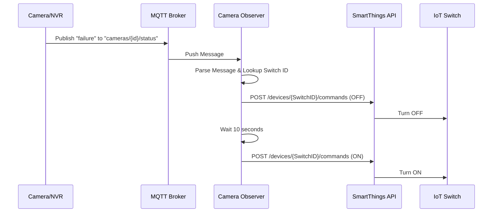

# Architecture

## Data Flow

The application operates as a reactive system.

## Modules

### 1. Observer (Manager)
The central orchestrator. It holds the configuration mapping (`CameraID` -> `SwitchID`).
- **Input**: Receives a `FailureEvent` struct from the MQTT module.
- **Process**: Checks if the camera ID exists in the mapping.
- **Output**: Calls `smartthings.RestartDevice(switchID)`.

### 2. MQTT Module
Handles the connection to the broker.
- **Subscription**: Subscribes to `cameras/+/status` (wildcard).
- **Payload Parsing**: Expects a JSON or simple string payload indicating status (e.g., `{"status": "error"}`).

### 3. SmartThings Module
A focused HTTP client.
- **Auth**: Uses `Bearer` token authentication.
- **Rate Limiting**: Should handle basic API limits (future improvement).
- **Action**: Sends standard Capability commands (`switch: off`, `switch: on`).

## Configuration Strategy
We use a hierarchical configuration:
1. **Defaults**: Hardcoded safe defaults.
2. **ConfigFile**: `config.yaml` for standard deployment.
3. **EnvVars**: Overrides for Docker (e.g., `MQTT_BROKER_URL`, `SMARTTHINGS_TOKEN`).
